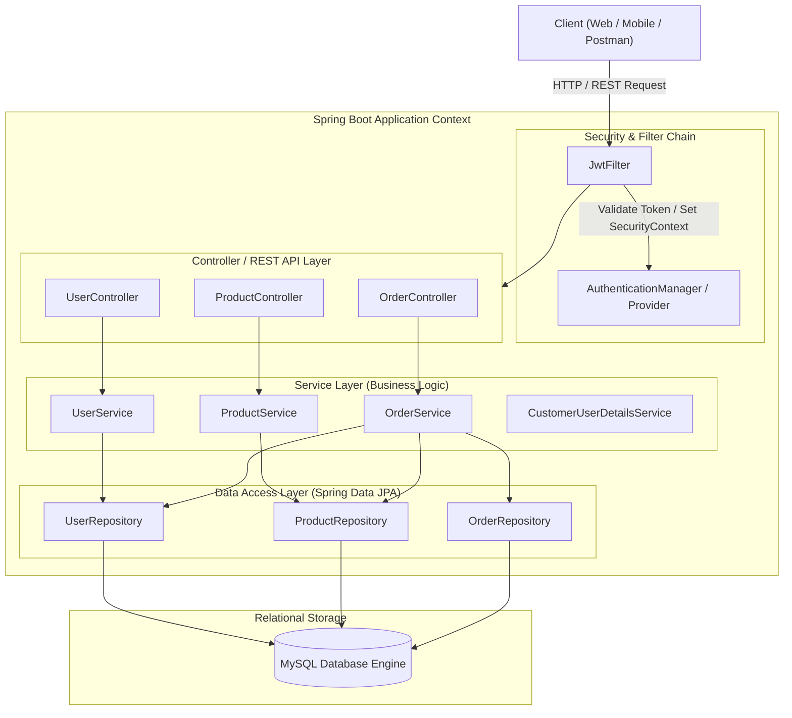

# 🛒 Enterprise E-Commerce RESTful Backend API

A foundational E-Commerce RESTful Backend engine built using **Java**, **Spring Boot**, **Spring Security**, **Spring Data JPA (Hibernate)**, and **MySQL**. 

This system handles user identity and Role-Based Access Control (RBAC) via stateless JWT tokens, basic product catalog management, and simple order placement.

---

## 📑 Table of Contents

- [Project Overview](#-project-overview)
- [Core Features](#-core-features)
- [System Architecture & Flow Diagrams](#-system-architecture--flow-diagrams)
- [Tech Stack](#-tech-stack)

---

## 🌟 Project Overview

This application serves as a backend engine for an e-commerce platform, focusing on standard RESTful principles and security:

- **Identity & Authorization:** Token-based stateless authentication using JWT.
- **Data Persistence:** Relational database mapping using JPA & Hibernate.
- **Clean Architecture:** Domain-Driven Layering (Controller → Service → Repository → Database).

---

## 🚀 Core Features

- **Authentication & RBAC:** User registration, password encryption via BCrypt, JWT generation/validation, and roles (`USER`, `ADMIN`).
- **Product Catalog Management:** Basic CRUD operations to add, view, and delete products (restricted to ADMIN for modifications).
- **Order Processing:** Checkout capabilities to convert requested product quantities into persistent order lines.

---

## 🏛️ System Architecture & Flow Diagrams

### High-Level Layered Architecture

